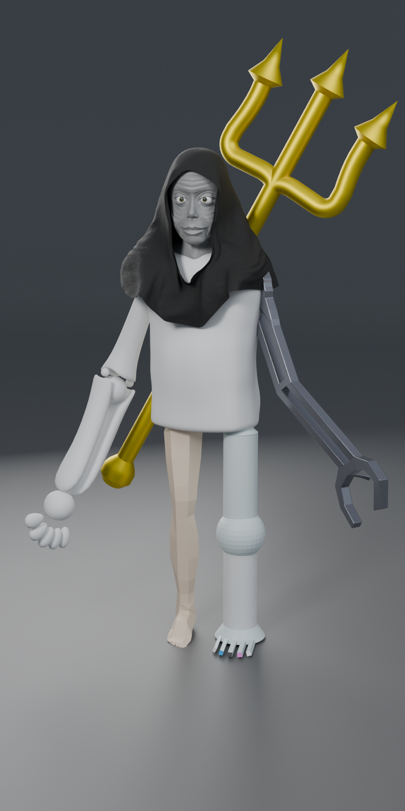

# Présentation du Projet | Project Presentation

## FR :

Ce projet consiste en la création collaborative d'un cyborg en 3D avec Blender. Chaque membre de notre club de modélisation, Model'IT, a modélisé une partie spécifique du corps du cyborg sans connaître les autres parties, pour les assembler au final et donner vie à ce personnage unique.

### Technologies Utilisées

- Blender

## ENG :

This project is a collaborative effort where members of my school's 3D modeling club, Model'IT, each modeled a different part of a cyborg in Blender without knowing what the others were working on. At the end, we assembled all the parts into a single cohesive 3D character.

### Technologies Used

- Blender

---

## Ce que j'ai appris | What I Learned

## FR :

Ce projet m'a permis de travailler en équipe sur un projet 3D complexe, tout en développant mes compétences en modélisation 3D dans Blender. J'ai appris à créer des éléments isolés, à respecter des contraintes de design sans connaître le contexte global, et à m'adapter aux autres pour l'assemblage final. J'ai aussi acquis une meilleure compréhension des rendus et des textures pour des projets collaboratifs.

## ENG :

Through this project, I gained experience working as a team on a complex 3D project while enhancing my Blender skills. I learned to create isolated components, adhere to design constraints without knowing the larger context, and collaborate with others for the final assembly. I also improved my understanding of rendering and texturing for collaborative projects.

---

## Auteur | Author

- [Nassim EL HADDAD](https://www.linkedin.com/in/nassim-el-haddad-4aa298271/)

---

### Liens Utiles | Useful Links

- [Blender](https://www.blender.org/)

---

### Image

